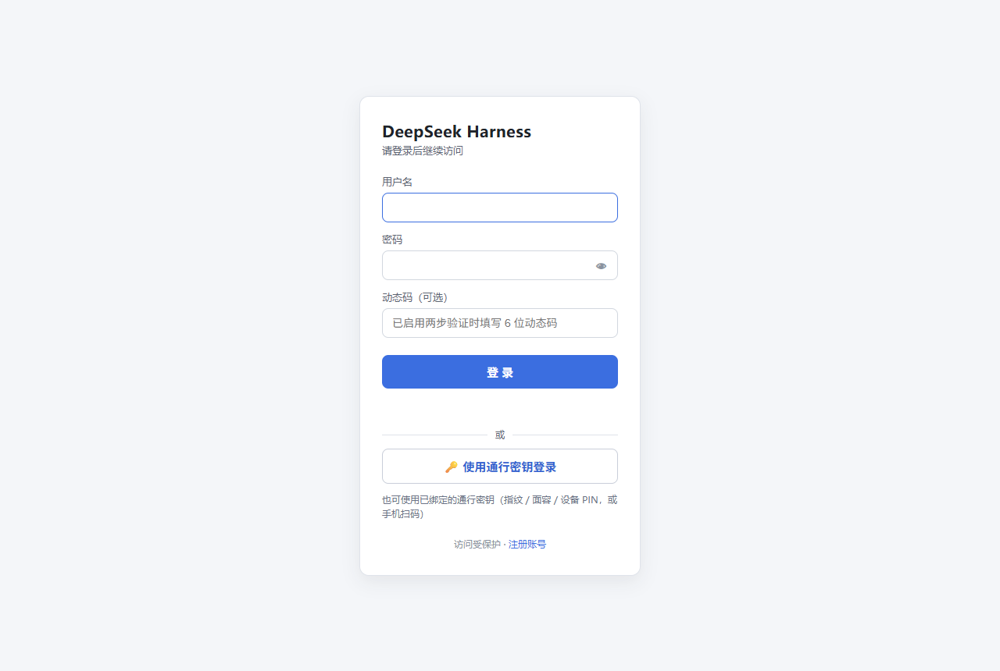
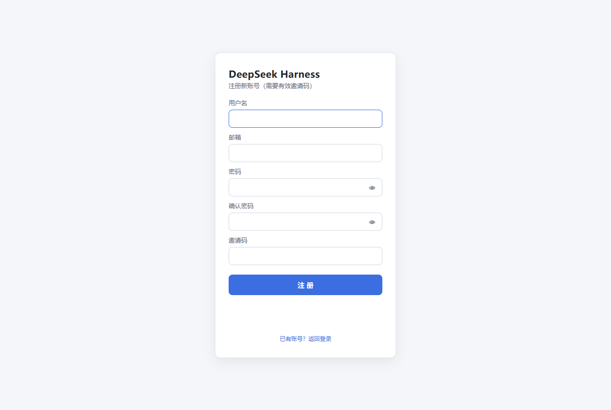
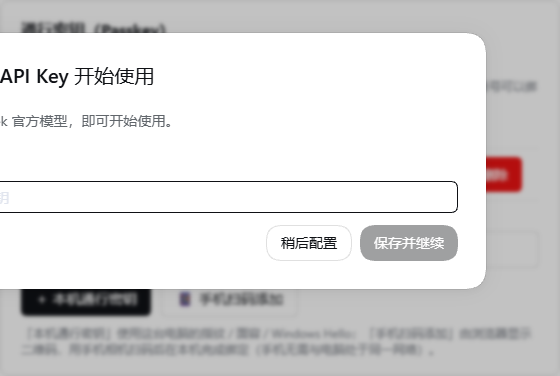
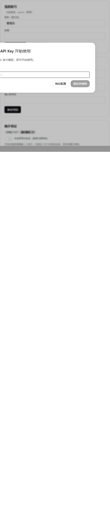
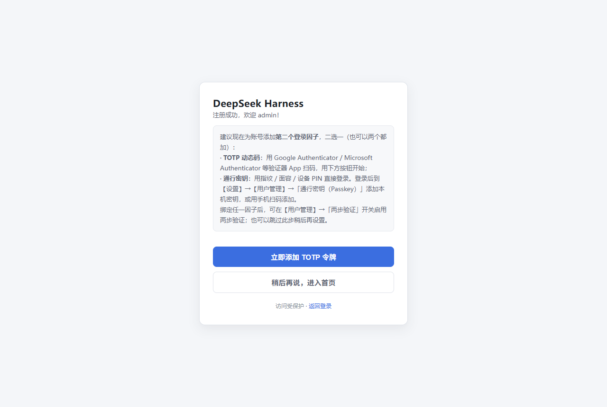

# dsh-ui-auth — DSH Web UI 认证网关插件

[](https://awesome-dsh-plugin.com)

给 DeepSeek Harness（DSH）的 Web UI 加一道**用户名 / 密码登录门**：未登录时无法访问任何页面、
API 或 WebSocket 通道；登录后可管理用户、邀请码、两步验证（TOTP）与**通行密钥（Passkey）**，
并按登录用户隔离会话数据。

适用场景：把 DSH 面板暴露到内网或公网时，需要一个前置认证层，并希望不同使用者之间互不可见。

## 特性一览

- **全接口拦截**：在 DSH 路由分发之前包装其 HTTP 服务器，覆盖 `/api/*`、`/plugins/*`、HMR、
  SPA fallback 与 WebSocket 升级通道，没有旁路。未登录时页面请求 302 跳登录页、API 返回 401、
  WS 升级直接断开；登录后原请求原样透传。
- **登录页与注册页**：中文界面，登录成功写入 `dsh_auth` Cookie（HttpOnly、SameSite=Strict、
  12 小时滑动续期）；注册需**邮箱 + 用户名 + 密码 + 有效邀请码**，注册成功自动登录并引导绑定 TOTP。
- **用户管理**：所有用户可改自己的昵称/邮箱/密码并管理自己的 TOTP 与通行密钥；管理员可增删用户、
  重置密码、切换角色、生成/撤销邀请码、清除某人的通行密钥。**任何人都无法查看他人的当前密码**。
- **两步验证（TOTP）**：RFC 6238，可用 Google / Microsoft Authenticator 扫码绑定，也支持手动输入密钥；
  启用后登录需「密码 + 动态码」（账号未绑定 TOTP 时，第二步改用通行密钥）。
- **通行密钥（Passkey / WebAuthn）**：用指纹、面容或设备 PIN 代替密码登录，一个账号可绑定多个
  （本机密钥 + 手机密钥）。支持**不输入用户名**的一键登录；手机可用浏览器显示的二维码扫码绑定。
  私钥永不离开用户设备，服务器只保存公钥。
- **模型与密钥仅管理员**：设置面板的「模型」页对普通用户替换为提示页；服务端同样强制——
  普通用户对模型/密钥相关接口一律 403，绕过界面直调 API 也无法修改。
- **按用户隔离**：会话与工作区在创建时记录归属；普通用户的会话/工作区列表只显示自己的，
  直连他人会话返回 403，WebSocket 事件流按归属**逐帧过滤**（在网络层就收不到他人数据）。
  管理员不受限。
- **登录防护**：密码 PBKDF2-HMAC-SHA256（每用户随机盐、60000 轮、常量时间比较）、
  密码策略「≥8 位且至少两种字符类型」、按来源 IP 的失败锁定、认证响应一律 `Cache-Control: no-store`；
  通行密钥使用一次性短时挑战、严格的来源/RP ID 校验与签名计数器回退检测。
- **会话与审计**：会话可跨重启恢复（磁盘只存 Token 的 SHA-256 哈希）；管理员操作与越权尝试
  写入 JSONL 审计文件。

## 环境要求

| 项 | 要求 |
|---|---|
| DSH | `0.1.1-rc.2`，或 `0.1.2-rc.1` ~ `0.1.5-rc.1`（web profile；两条传输线都支持，见「DSH 版本兼容性」） |
| Node.js | `^22.19.0 || >=24.0.0`（与 DSH 一致） |
| 运行时依赖 | `qrcode`（生成 TOTP 二维码）、`ws`（流式通道）与 `@simplewebauthn/server`（通行密钥服务端校验），安装时自动获取，无需手动构建 |
| 浏览器 | 通行密钥需要 Chrome / Edge / Safari / Firefox 等支持 WebAuthn 的现代浏览器；不支持时其余功能不受影响 |

**通行密钥对访问地址有硬性要求**（浏览器规则，插件无法绕过）：

| 访问地址 | 通行密钥 | 说明 |
|---|---|---|
| `https://你的域名` | ✅ 可用 | 推荐的生产部署方式（反代终止 TLS） |
| `http://localhost:3080` | ✅ 可用 | 本机使用请用 `localhost`，不是 `127.0.0.1` |
| `http://127.0.0.1:3080` | ❌ 不可用 | Chrome 拒绝 IP 地址作为通行密钥域（RP ID）；面板会提示改用 `http://localhost:3080` |
| `http://内网IP:3080` | ❌ 不可用 | 明文 HTTP 不是安全上下文，且 IP 不能作为 RP ID；需域名 + HTTPS |

## 安装

本包是标准的 DSH profile bundle（声明了 `dsh.bundle.patch` 与 `dsh.client`），
`dsh plugin` 会自动把它加入 profile 的 bundle 名单：

```bash
# 从 npm 安装
dsh plugin --profile web add dsh-ui-auth

# 或固定到某个 GitHub 发行版本
dsh plugin --profile web add github:0QwQ0/dsh-ui-auth#v0.6.4

# 或从本地目录安装（离线 / 二次开发）
dsh plugin --profile web add <本插件目录的绝对路径>
```

安装完成后**重启一次面板**生效（bundle 层在启动时应用）。

## 首次登录

用户表为空时，插件会自动创建管理员 `admin`，随机密码同时输出到两处：

1. 面板控制台日志（以 `[dsh-ui-auth]` 开头）；
2. 面板进程工作目录下的 `dsh-ui-auth-bootstrap.txt`。

打开面板会跳转到 `/auth/login`，用 `admin` 与上述随机密码登录。
**登录后请立即在【设置】→【用户管理】中修改密码**；任意用户改密成功后，引导文件会自动删除。

## 使用指南

### 设置面板 → 用户管理

- **所有用户**：修改自己的昵称、邮箱、密码；绑定/移除自己的 TOTP 令牌；添加/重命名/删除自己的
  通行密钥；开关两步验证。
- **管理员**：新增/删除用户、重置他人密码、切换角色、生成与撤销邀请码（可查看每个码的
  已用次数与剩余次数）、移除任意用户的 TOTP、清除任意用户的通行密钥（设备丢失时救援）。
- **保护规则**：不能删除或降级最后一个管理员，不能删除自己；改密或删除用户后，其其他会话立即失效。

### 注册与邀请码

注册入口在登录页的「注册账号」。新用户需要管理员事先在【用户管理】→【邀请码管理】中生成的**有效邀请码**；
每个码可设置 1–100 次的注册次数，可随时撤销。邮箱目前只做格式填写、不校验真实性，注册后可在用户管理中修改。

### 两步验证（TOTP）与通行密钥（Passkey）

两步验证可以用两种因子满足：**TOTP 动态码**或**通行密钥**。绑定任一种后即可在
【用户管理】→「两步验证」用开关启用；开关打开后，登录方式如下（通行密钥**始终**可直接登录，
与两步验证开关无关）：

| 账号状态 | 可用的登录方式 |
|---|---|
| 两步验证关闭 | 用户名 + 密码；通行密钥 |
| 两步验证开启，已绑定 TOTP | 用户名 + 密码 + 动态码；通行密钥 |
| 两步验证开启，只绑定了通行密钥 | 用户名 + 密码 + 通行密钥；通行密钥（可不填用户名） |

> 0.6.4 起**移除了「免密 + 动态码」登录**：只有动态码、没有密码的登录请求一律被拒绝。
> 免密入口统一收敛到通行密钥。

**TOTP**：在【用户管理】→「两步验证（TOTP）」生成密钥，用验证器 App 扫码（或手动输入密钥 /
otpauth 链接）后输入 6 位动态码完成绑定。动态码错误同样计入失败锁定；移除令牌需要当前动态码，
管理员可移除任意用户的令牌。

**通行密钥**：在【用户管理】→「通行密钥（Passkey）」中添加，同一个账号可以绑定多个：

- **＋ 本机通行密钥**：使用这台电脑的 Windows Hello / Touch ID / 设备 PIN；
- **📱 手机扫码添加**：浏览器会显示二维码，用手机相机扫码后在本机完成绑定（手机无需与面板处于同一网络，
  也不需要手机能访问面板）；
- 绑定后登录页会出现「🔑 使用通行密钥登录」，点击即可**不输入用户名与密码**直接登录；
  也可以照常输入用户名密码，在第二步提示时用通行密钥完成验证。

安全约定：通行密钥的私钥**永不离开设备**，服务器只保存公钥与名称等公开信息；添加、重命名、删除
通行密钥都需要先确认当前密码（两步验证开启时还需动态码或一次已有通行密钥的确认）；
为避免账号被锁死，两步验证开启且只剩一个通行密钥时不允许删除它——请先绑定 TOTP 或先关闭两步验证。
设备丢失时，管理员可在【用户管理】中「清除通行密钥」救援。

### 模型页与密钥

【设置】→【模型】（含模型选择与 API Key 配置）**仅管理员可用**：

- 服务端强制：普通用户对模型/密钥相关接口（`settings.*` 的 LLM 命名空间、`credentials.set/unset`、
  `llm.discoverModels`）一律返回 403，绕过 UI 直调 API 同样被拒；
- 客户端：普通用户的「模型」页显示「仅管理员可访问」，并隐藏出厂的「模型」导航行。

### 数据隔离

DSH 本身按单用户设计（会话、工作区是机器级数据）。本插件按**登录用户**隔离：

- 会话/工作区创建时记录归属；列表与搜索接口在响应侧过滤（含工作区内会话与归档会话）；
- 直接访问非属主对象（如他人的会话内容、重命名、提示词）返回 403；会话导出仅限属主；
- WebSocket 事件流按归属逐帧过滤——普通用户在**网络层**就收不到他人会话的事件帧，浏览器控制台同样看不到；
- 管理员可见全部数据；插件启用**之前**已存在的旧数据默认归管理员。

## 界面预览

| 登录页（含通行密钥入口） | 注册页 |
|---|---|
|  |  |

| 通行密钥（Passkey）卡片 | 用户管理页 |
|---|---|
|  |  |

| 注册成功引导页（绑定第二个因子） |
|---|
|  |

> 截图由 `node test/shot.mjs` 在**一次性实例**上生成（见该脚本头部的环境变量说明），
> 因此图中不含任何真实账号数据。通行密钥相关界面必须在 `localhost` 或域名 + HTTPS 下才会完整渲染。

## 配置（可选环境变量）

| 变量 | 默认 | 说明 |
|---|---|---|
| `DSH_AUTH_MAX_FAILS` | `5` | 单来源连续登录失败锁定阈值（正整数；非法值回退默认） |
| `DSH_AUTH_LOCK_MS` | `30000` | 锁定持续时间（毫秒） |
| `DSH_AUTH_TRUST_PROXY` | 关 | 设为 `1`/`true`/`yes` 时信任 `X-Forwarded-For`（**取最右**，即最近一层受信代理追加的地址，客户端无法伪造）与 `X-Forwarded-Proto`（用于 Secure Cookie）。**仅在 HTTPS 反向代理之后开启**；默认不信任，避免未配置代理时伪造请求头绕过或污染限流 |
| `DSH_AUTH_RP_ID` | 自动 | 通行密钥域（WebAuthn RP ID）。默认按浏览器实际访问的主机名推导；只有在反向代理改写了 Host、或需要在子域间共享通行密钥时才需要显式设置（必须是访问域名的后缀） |
| `DSH_AUTH_ORIGIN` | 自动 | 通行密钥校验的期望来源（如 `https://panel.example.com`）。反代终止 TLS 且插件看到的 Host/协议不是浏览器所见时设置 |
| `DSH_AUTH_RP_NAME` | `DeepSeek Harness` | 通行密钥在系统弹窗中显示的账号名 |

面板进程启动时读取，修改后需重启面板。示例：

```powershell
$env:DSH_AUTH_MAX_FAILS = '10'; $env:DSH_AUTH_LOCK_MS = '60000'; $env:DSH_AUTH_TRUST_PROXY = '1'
```

```bash
export DSH_AUTH_MAX_FAILS=10 DSH_AUTH_LOCK_MS=60000 DSH_AUTH_TRUST_PROXY=1
```

## 数据与持久化

| 内容 | 位置 | 说明 |
|---|---|---|
| 用户、角色、资料、密码哈希、TOTP 密钥、通行密钥（公钥）、邀请码 | DSH 凭据库 `~/.dsh/.credentials.yaml` 中的 `dsh-auth/*` 记录 | 重启后保留；**不保存明文密码，也不保存通行密钥私钥**（私钥只存在于用户设备） |
| 登录会话 | 面板进程工作目录下的 `dsh-ui-auth-sessions.json` | 只存 Token 的 SHA-256 哈希；未过期会话重启后免登录恢复 |
| 审计日志 | 面板进程工作目录下的 `dsh-ui-auth-audit.jsonl` | JSONL，每行含时间、操作者、动作、目标等字段 |
| 首次启动引导文件 | 面板进程工作目录下的 `dsh-ui-auth-bootstrap.txt` | 任一用户改密成功后自动删除 |

**备份**：备份 `~/.dsh/.credentials.yaml` 即可保留全部账号数据。

**彻底清空**：删除 `~/.dsh/.credentials.yaml` 中 `dsh-auth:` 下的记录，并删除上述工作目录里的
`dsh-ui-auth-sessions.json`、`dsh-ui-auth-audit.jsonl` 与 `dsh-ui-auth-bootstrap.txt`，然后重启面板
（用户表为空时会重新生成新的管理员与随机密码）。

## 卸载

```bash
dsh plugin --profile web remove dsh-ui-auth
# 重启面板后网关、设置面板与客户端模块全部消失；profile 的依赖与 bundle 名单自动还原
```

卸载**不会**删除账号数据（防误删）；如需一并清空，见上一节。

## 安全说明与已知边界

- **密码与会话**：PBKDF2-HMAC-SHA256（随机盐、60000 轮、常量时间比较）；密码策略为
  「≥8 位且至少两种字符类型」；会话 Token 仅以 SHA-256 哈希落盘，登出、改密或删除用户后相关会话立即失效。
- **Cookie**：`dsh_auth` 为 HttpOnly + SameSite=Strict；在 TLS 直连或（仅在信任反代时）
  `X-Forwarded-Proto: https` 的通道下自动追加 `Secure`。
- **公网部署建议**：放在 HTTPS 反向代理之后，由代理终结 TLS 并保留 Host；DSH 自身可监听
  `127.0.0.1` 或内网。反代场景请按上文开启 `DSH_AUTH_TRUST_PROXY=1`，否则限流会按代理 IP 聚合。
- **会话持久化带来「记住登录」**：未过期的会话在面板重启后自动恢复；若你的安全要求是每次重启都必须重新登录，
  可在停止面板后删除 `dsh-ui-auth-sessions.json`。
- **升级提示**：从 0.5.1 之前的版本升级时，旧版**明文**会话记录不再恢复，所有用户需要重新登录一次。
- **与 DSH 自带机制的关系**：DSH 对 `/api` 的 DNS-rebinding 信任栅栏**明确不是认证**；
  本插件才是前置认证层，两者叠加使用。
- **隔离强度的上限**：本插件按登录用户隔离 DSH 的会话/工作区数据；它不改变 DSH 自身的进程权限模型，
  也不能隔离第三方插件自己的数据。多租户级别的强隔离需要 DSH 侧的支持。
- 更完整的安全分析（威胁模型、用例矩阵、残余风险与部署加固清单）见 [SECURITY.md](SECURITY.md)。

## DSH 版本兼容性

同一份代码按能力探测自动选择传输适配，无需配置：

| DSH 版本 | 传输线 | 说明 |
|---|---|---|
| `0.1.1-rc.2` | legacy | dotted `/api/<a>.<b>` RPC 与 `apiProxy` 事件流，历史行为保持不变 |
| `0.1.2-rc.1` ~ `0.1.5-rc.1` | modern | 斜杠 RPC `/api/<ns>/<method>`、`/api/remote.mux` 流式通道与原生浏览器会话门 |

modern 传输线为安全起见对普通用户**更严格**：不能创建 workspace（工作区目录属部署方能力），
也不能写入任何设置命名空间；需要放开时可由宿主插件通过 `uiAuth` 接口登记策略。
端点清单、收紧项与验证证据见 [docs/DSH-0.1.5-COMPATIBILITY.md](docs/DSH-0.1.5-COMPATIBILITY.md)。

## 常见问题

**忘记管理员密码怎么办？**
删除 `~/.dsh/.credentials.yaml` 中 `dsh-auth/admin`（及其对应的哈希记录），重启面板后会重新生成 `admin`
与新的随机密码（原账号的 TOTP、通行密钥与资料会丢失）。其他用户的密码可由管理员在用户管理中重置。

**绑定的通行密钥设备丢了怎么办？**
两个办法：① 若该账号还绑定了 TOTP，用「密码 + 动态码」登录后在【用户管理】里删除丢失的通行密钥；
② 请管理员在【用户管理】→ 对应用户行点「清除通行密钥」。管理员自己的通行密钥若全部丢失且未绑定 TOTP，
只能按上一条重置 `admin` 记录（这也是「两步验证开启时不允许删除最后一个通行密钥」的原因）。

**通行密钥按钮不可用 / 提示改用 localhost？**
浏览器不允许把 IP 地址当作通行密钥域。请用 `http://localhost:3080` 打开面板，或给面板配一个域名并走 HTTPS。
面板会直接给出应该使用的地址。

**手机扫码绑定后，手机上也能直接登录面板吗？**
可以。手机通行密钥是「可同步/混合」凭据：手机浏览器打开同一地址（必须同样是域名或 `localhost`）即可用
指纹/面容直接登录；无需电脑在场。

**重启面板后需要重新登录吗？**
不需要。未过期的会话会自动恢复；只有在从 0.5.1 之前的版本升级时，旧会话记录会失效一次。

**普通用户看不到「模型」页，是故障吗？**
不是，这是设计：模型与 API Key 仅管理员可配置，服务端与界面同时强制。

**登录限流把所有人都算成同一个来源？**
说明面板前面有反向代理。按上文开启 `DSH_AUTH_TRUST_PROXY=1`，限流将按真实客户端 IP 计数。

**邀请码用完了 / 想关闭注册？**
注册必须持有效邀请码，因此不生成邀请码即等于关闭注册；管理员可随时生成或撤销。

**可以只要认证、不做数据隔离吗？**
当前版本始终启用按用户隔离。需要自定义策略的部署可通过宿主插件调用 `uiAuth` 接口（见兼容性文档）。

## 开发

源码为 TypeScript，构建产物一并提交（DSH 直接读取仓库，因此**运行与安装不需要构建**）：

```bash
npm ci                 # 安装开发依赖（typescript / esbuild / @types/*）
npm run typecheck      # 宿主与客户端两套 tsconfig 的严格类型检查
npm run build          # src/*.ts → lib/*.js
npm test               # 构建 + 全链测试（安全套件、策略回归、冒烟与向量）
npm run verify:clean   # 校验 lib/ 与 src/ 一致（修改源码后需提交重新构建的产物）
```

| 源码 | 产物 | 说明 |
|---|---|---|
| `src/index.ts` | `lib/index.js` | 宿主：网关、认证、用户管理、审计、通行密钥端点 |
| `src/webauthn.ts` | `lib/webauthn.js` | 通行密钥：RP/来源解析、一次性挑战、注册与登录校验封装 |
| `src/modern-gateway.ts` | `lib/modern-gateway.js` | DSH 0.1.2+ 传输适配 |
| `src/modern-policy.ts` | `lib/modern-policy.js` | 端点授权与数据过滤策略 |
| `src/client.ts` | `lib/client.js` | 设置面板客户端（由 `build/client.mjs` 打成 DSH 客户端契约） |
| `src/passkey-browser.ts` | `lib/passkey-browser.js` | 登录页用的 WebAuthn 浏览器端 bundle（同一份社区库） |

更多文档：[兼容性与隔离策略](docs/DSH-0.1.5-COMPATIBILITY.md) ·
[安全审计与测试证据](docs/STORE-EVIDENCE.md) · [发布流程（维护者）](docs/PUBLISHING.md) ·
[变更记录](CHANGELOG.md) · [MIT 许可证](LICENSE)
